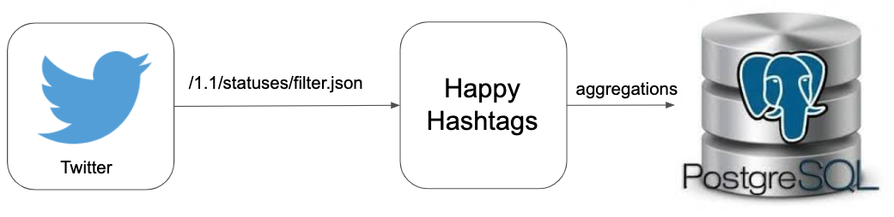
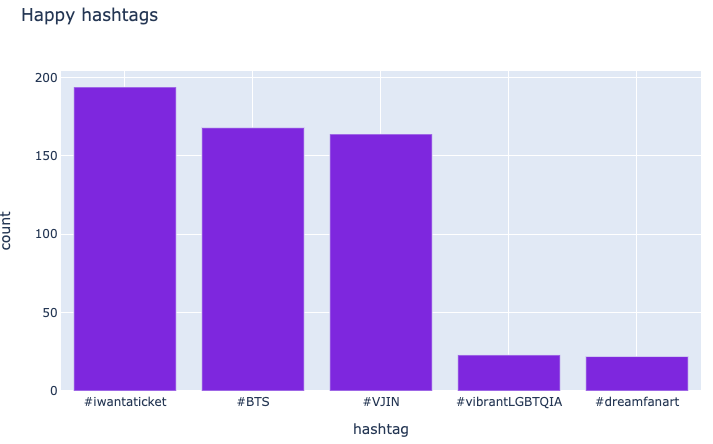

# Happy hashtags

## Intro

The goal of this project is to help finding the "happiest hashtag(s)" from the Twitter by processing a stream of tweets provided by their API.

A hashtag is considered "happy" if it belongs to a tweet that contains the emoji `:)` or any list of emojis that is configured.

## Architecture

The data flows from the Twitter API, is aggregated by the application and is then inserted into Postgres, where it can be consumed by many visualization tools.

## Getting started

To start the application:

- Make sure you have [Docker](http://docker.com/) installed
- Make sure you have configured the `API_*` environment variables on `docker-compose-dev.yml`
- Run `make setup` (only needed if it was not initialized before)
- Run `make up`

PS: Stopping the docker containers can be done with `make down`

## Schema migrations

Schema migrations are handled in this project using the [alembic](https://alembic.sqlalchemy.org/en/latest/) library.
It uses the environment variables `POSTGRES_*` to construct the connection uri.

To add a new migration, add a new version to `alembic/versions/`.

Even though the migrations are part of the `setup` step, they can be executed separately with `make migrate` command.

## Visualization

This project is meant to provide the data that can be used to generate reports, but not to generate the reports itself. This way it allows more use cases to be served.

There is a variety of tools that connect to the Postgres database.
For example, I used a python library called `plotly` to query the database and generate the following graph:

## Deployment

As the application is dockerized, deploying it to a cloud service (like [ECS](https://aws.amazon.com/ecs/)) should not be a major challenge. The database can also be replaced by a cloud alternative (like [RDS](https://aws.amazon.com/rds/)).

## Tests

To execute the tests, run `make test`.

## Improvements

Suggestions for improvements in the project:

- Ignore repeated hashtags from the same user on a session to minimize spam
- Add a queue of tweets to be processed to make sure no data gets lost
- Instead of pure python, use a distributed data processing solution like [Spark Streaming](https://spark.apache.org/streaming/)
- Split the test and app containers to avoid installing unnecessary dependencies
